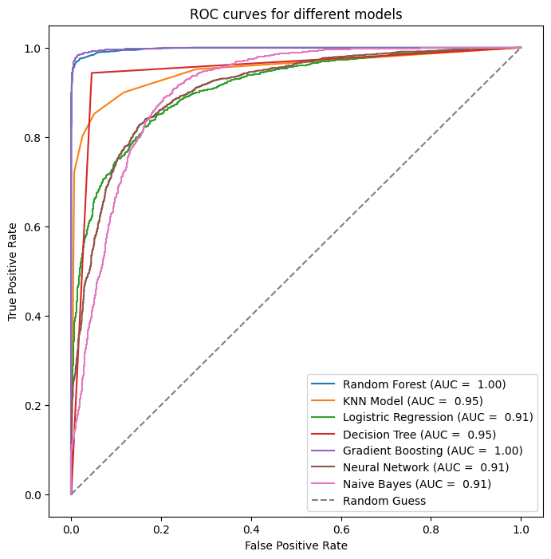
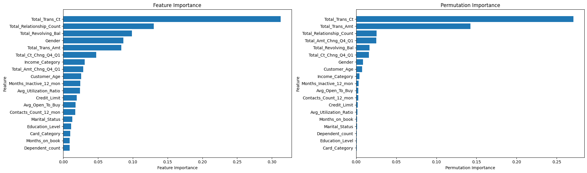

# Churn_prediction

[](https://www.python.org/)
[](https://streamlit.io/)
[](https://www.docker.com/)


# 📝 Description

An important financial institution is interested in analyzing its client database to increase revenue generated from credit cardholders while reducing churn rates. With a churn rate exceeding 15% and showing an upward trend, the CEO has tasked the marketing team with initiating a campaign for client retention.

The dataset, named `BankChurners.csv`, was provided by the client (Kaggle). During preprocessing (refer to **Preprocessing Data**), three columns were dropped per client advice, including the last two columns and the client number column, as they were deemed irrelevant for data processing. To ensure data cleanliness, 'Unknown' values were handled differently based on the modeling approach.

Label encoding was employed to transform string values into integers, a necessary step for model training.

# 🔧 Installation

To utilize the model with the existing data, no installation is required. Simply access StreamLite via: [StreamLite Link](https://carolinevhk-churn-prediction-app-qz0a13.streamlit.app/).

For implementation with custom data, clone the repository and follow the instructions detailed in the `requirements.txt` file.

# 📂 Repo Structure

```
.
├── data
│ ├── BankChurners.csv
│ ├── exploration_data.ipynb
├── GradientBoostingModel
│ ├── prediction.py
│ ├── train.py
├── images
│ ├── Importance_gbmodel.png
│ ├──  pairplot.png
│ ├──ROC_curve.png
├── testing_models
│ ├── Churner_smoted.csv
│ ├── ideas.py
│ ├── test_models.py
│ ├── test_prediction.py
├── venv
├── .gitignore
├── app.py
├── best_model_Gradient Boosting.pkl
├── classification.py
├── Dockerfile
├── Gradient_Boosting_model.pkl
├── README.md
├── requirements.txt

```

# 🚀 Usage

Downloading the model facilitates the bank in predicting whether a customer will churn within a specified time frame. When using your data, ensure it follows the same template as the provided CSV file.

# ⚠️ **Data Sources**

The data utilized in this project is sourced from Kaggle's [Credit Card Customers](https://www.kaggle.com/sakshigoyal7/credit-card-customers).

# 🖼️ Visuals

## Model Evaluation

| Model                    | Accuracy | Precision | Recall | F1 Score | ROC-AUC Score |
|--------------------------|----------|-----------|--------|----------|---------------|
| Random Forest            | 0.9779   | 0.9849    | 0.9702 | 0.9775   | 0.9778        |
| KNN Model                | 0.9012   | 0.9420    | 0.8520 | 0.8947   | 0.9005        |
| Logistic Regression      | 0.8285   | 0.8132    | 0.8467 | 0.8296   | 0.8288        |
| Decision Tree            | 0.9491   | 0.9530    | 0.9433 | 0.9481   | 0.9490        |
| Gradient Boosting        | 0.9832   | 0.9885    | 0.9773 | 0.9829   | 0.9832        |
| Neural Network           | 0.8153   | 0.7617    | 0.9099 | 0.8293   | 0.8166        |
| Naive Bayes              | 0.8235   | 0.8367    | 0.7977 | 0.8167   | 0.8232        |
| Support Vector Classifier| 0.7335   | 0.7331    | 0.7226 | 0.7278   | 0.7334        |

### ROC-curve



## Feature vs Permutation Importance
This highlights the features that have the most significant impact on the model's performance.



### What about this graphic? 
You can observe the most influential features for predicting whether a client churns or not. In both scenarios, the top five significant features are: Total_Trans_Ct, Total_Relationship_Count, Total_Revolving_Bal, Gender, and Total_Trans_Amt. These features exhibit high similarity in their Permutation Importance rankings. However, given that we employ a Gradient Boosting ML model, the Feature Importance is predominantly derived from this model. Consequently, we place greater reliance on its assessment of feature importance.

# 🏁 Final conclusion

In conclusion, the most critical features for predicting churn in clients are:

- **Total_Trans_Ct:** Count of transactions for the last 12 months.
- **Total_Relationship_Count:** Number of products the customer has.
- **Total_Revolving_Bal:** Total balance on the credit card.
- **Gender**
- **Total_Trans_Amt:** Amount of transactions for the last 12 months.

Understanding the significance of these features provides valuable insights for the client.

### Recommendations for the Client:

1. **Enhance Customer Engagement:** Increase interaction with customers to boost transaction counts and contacts. Implement personalized communication and targeted marketing campaigns to foster stronger relationships.

2. **Diversify Product Offerings:** Encourage customers to diversify their product portfolio to increase the number of products they hold. Provide incentives or rewards for adopting additional products or services offered by the institution.

3. **Manage Credit Card Balances:** Educate customers on responsible credit card usage to reduce revolving balances and improve financial stability. Offer guidance on budgeting and encourage timely repayment to minimize revolving balances.

4. **Promote Financial Health:** Offer credit management tools and resources to help customers monitor and improve their financial health. Provide insights on credit utilization and recommend strategies to optimize credit limits and balances.

5. **Optimize Transactional Behavior:** Analyze transactional patterns and identify opportunities to enhance transaction amounts and counts. Offer rewards or incentives for increasing transaction frequency or volume.

By focusing on these areas, the client can proactively address factors contributing to churn and implement strategies to strengthen customer loyalty and satisfaction. Continuous monitoring and analysis of these parameters can provide valuable feedback for refining retention strategies and optimizing customer experiences in the long term.


# 👥 Contributors

Despite being a solo project, I extend my gratitude to my colleagues at Becodian. Their invaluable brainstorming sessions and assistance in debugging the entire script were instrumental in completing this project.

# ⏰ Timeline

This project was completed within a timeframe of 5 working days.

# 📌 Personal Note

(Add any personal notes or acknowledgments here)
